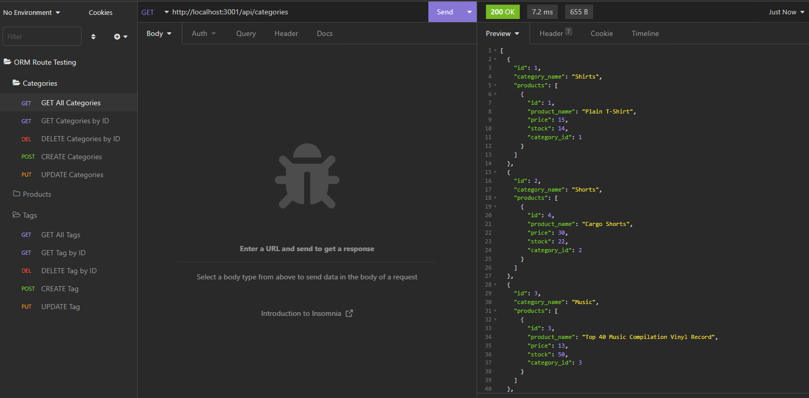
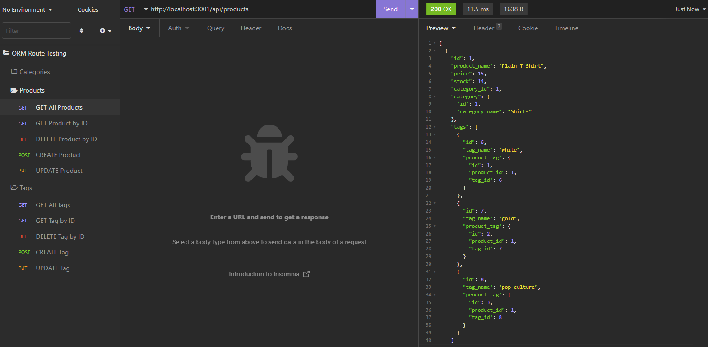
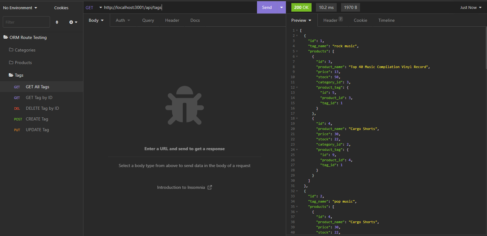

# orm-ecommerce

## Table of Contents
1. [Description](#description)
2. [Technology](#technology) 
3. [Installation](#installation)
4. [Visuals](#visuals)
5. [License](#license)

## Description
This application serves to connect a user with a variety of products, stored in a mock database, and accessed via local routing. The functionality allows a user to create, search, update and delete products, as well as their associated categories and tags. 

Demonstrative of the object-relational mapping method of data management. Useful in an e-commerce setting with a more defined set of data values and relationships (defined via api routing, and model based organization). Using a RESTful API structure, this application is able to perform `GET, POST, PUT`, and `DELETE` requests to find and manipulate stored data in the generated e-commerce database.

## Technology
This application leverages the following npm packages: 
\
[Dotenv](https://www.npmjs.com/package/dotenv) as a zero-dependency module that loads environment variables from a .env file into process.env. Storing configuration in the environment separate from code. 
\
[Express](https://www.npmjs.com/package/express) as a web framework for node.js 
\
[Mysql2](https://www.npmjs.com/package/mysql2) and
[Sequelize](https://www.npmjs.com/package/sequelize) are used to connect the application to a MySQL database, allowing a user to successfully create, read, update, and delete information within the database. Functionality of the api requests is demonstrated via Insomnia in the following video:
\
[Video Walkthrough](https://drive.google.com/file/d/1ponnkLk59a53OkXTijNQUV9tyzGjjJTE/view)

## Installation
Run 'npm i' within the console, located at the root level of the directory. This will pull in the necessary node modules/packages.

Following the package install, run "mysql -u root" to open sequel terminal, then enter "SOURCE db/schema.sql" to establish our database in use (ecommerce_db). From this point please "exit" sequel shell. 

Once database is created, enter "npm run seed" within the terminal to seed the content from the seeds folder.

Lastly, enter "npm run start" in the console. This will open a port at localhost:3001, accessible when 'localhost:3001' searched in browser, or when opened via Insomnia as demonstrated in the video link provided above.

## Visuals
Functionality and usage demonstrated via Insomnia based queries:
\
\
Categories

Products

Tags

## License
This application is licensed with the MIT License.